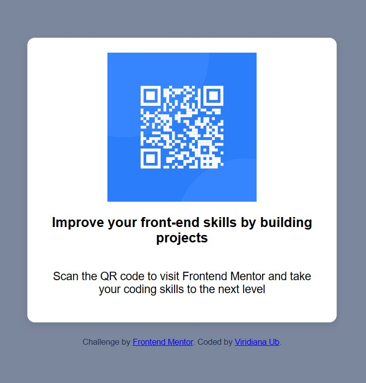

## Table of contents

- [Overview](#overview)
  - [Screenshot](#screenshot)
  - [Links](#links)
- [My process](#my-process)
  - [Built with](#built-with)
  - [What I learned](#what-i-learned)
  - [Continued development](#continued-development)
  - [Useful resources](#useful-resources)
- [Author](#author)
- [Acknowledgments](#acknowledgments)

## Overview

### Screenshot

### Links

- Solution URL: [Add solution URL here](https://your-solution-url.com)
- Live Site URL: [Add live site URL here](https://your-live-site-url.com)

## My process

### Built with

- Semantic HTML5 markup
- Flexbox

### What I learned

<h3>What I Learned</h3>

<h4>Using HTML5 and CSS for Responsive Design</h4>

Throughout this project, I learned the importance of <strong>semantic HTML5</strong> and how its proper implementation can enhance web page accessibility and structure. Using clear and precise tags, I established a solid foundation for site content.

The use of the <code>viewport</code> meta-tag was essential to ensure the site displays correctly on different devices. This practice is crucial for responsive web design, allowing the page to adapt to the user's device size without needing specific designs for each possible screen.

<h4>CSS for Styling and Alignment</h4>

Managing CSS taught me how to use flexbox to center elements both horizontally and vertically, which is particularly useful in responsive and minimalist designs. The <code>flex-direction</code> property was key in effectively managing element layout, aiding in the creation of layouts that adjust to various screen sizes.

I also experimented with properties like <code>background-size</code>, <code>border-radius</code>, and <code>box-shadow</code> to add depth and visual texture to the design. These visual styles not only enhance the page's aesthetics but also improve the user experience by making the interface more attractive and user-friendly.

<h4>The Importance of Typography and Visual Design</h4>

Using 'Outfit', a sans-serif font, reinforced my understanding of how font choice can impact readability and the overall perception of a website. Adjusting font size and weight in various elements (such as paragraphs in <code>.qr-container</code>) helped create a clear visual hierarchy, making it easier for users to read and understand the content.

<h4>Final Reflections</h4>

This project not only improved my technical skills in HTML and CSS but also taught me the importance of user-centered design. I learned that every detail, from code structure to the last style adjustment, contributes to how a website is perceived and interacted with. Implementing a methodical and thoughtful approach to web design and development ensures that the final product is accessible, aesthetically pleasing, and functional for all users.

Overall, these lessons have not only enriched my technical knowledge but also sharpened my sensitivity towards inclusive and effective web design and development.

## Author

- Frontend Mentor - [@VIUbaldoMendoza](https://www.frontendmentor.io/profile/VIUbaldoMendoza)

